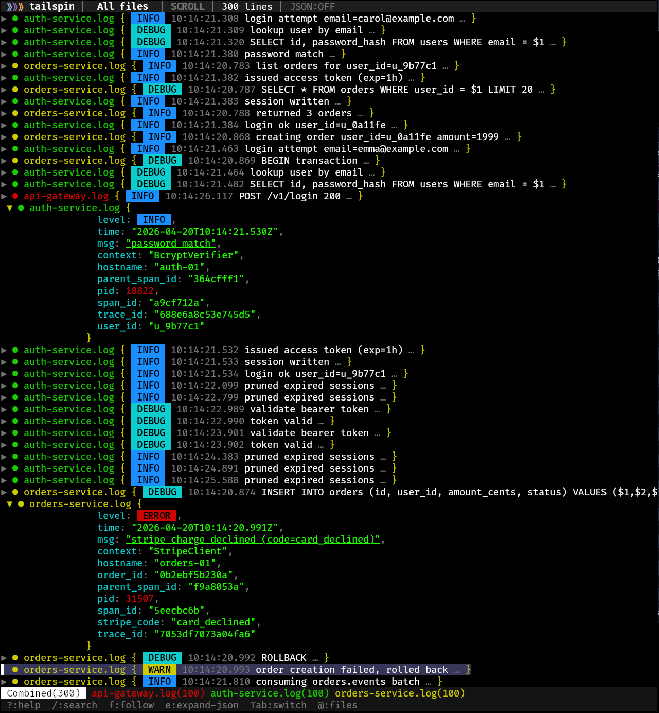

# Tailspin

A lightweight, open-source tool designed to streamline local log file monitoring
during development. Tail one or many log files in a terminal UI with JSON
expansion, regex search, multi-file tabs, and follow mode.



## Quickstart

```
git clone git@github.com:matthandlersux/tailspin.git
cd tailspin
just install
./bin/tailspin path/to/logfile1.log path/to/logfile2.log
```

Add `$THIS_FOLDER/bin` to your `PATH` and invoke `tailspin` from anywhere.

## Features

- Multi-file tailing with combined and per-file tab views
- Abridged JSON view (level/time/msg) with click-to-expand and syntax coloring
- Regex search with highlighting and match navigation
- Fuzzy file picker for fast tab switching
- Mouse support: click to select, scroll to move cursor, click the left arrow to toggle JSON
- Auto-scroll follow mode
- Log level color coding (INFO, WARN, ERROR, DEBUG, TRACE)
- Syntax highlighting for timestamps, quoted strings, and dates

## Keybindings

| Key | Action |
| --- | --- |
| `/` | start search |
| `n` / `p` | next / previous match |
| `*` | yank current line into search |
| `j` / `k` or arrows | move cursor |
| `PageUp` / `PageDown` | page up/down |
| `g` / `G` or `Home` / `End` | jump to top / bottom |
| `Enter` | toggle JSON expand on current line |
| `e` | expand / collapse all JSON |
| `f` | toggle follow mode |
| `Tab` / `Shift-Tab` | next / previous tab |
| `` ` `` or `0` | combined view |
| `1`..`9` | jump to tab N |
| `@` or `Ctrl+T` | fuzzy file picker |
| `?` | help overlay |
| `q` or `Ctrl+C` | quit |

## Building

Requires Rust (cargo). Helpful commands are in the [justfile](https://github.com/casey/just):

```
just build            # debug build
just build-release    # release build
just run path/to/log  # run from source (debug)
just run-release path/to/log
just install          # release build + copy to bin/tailspin
```
