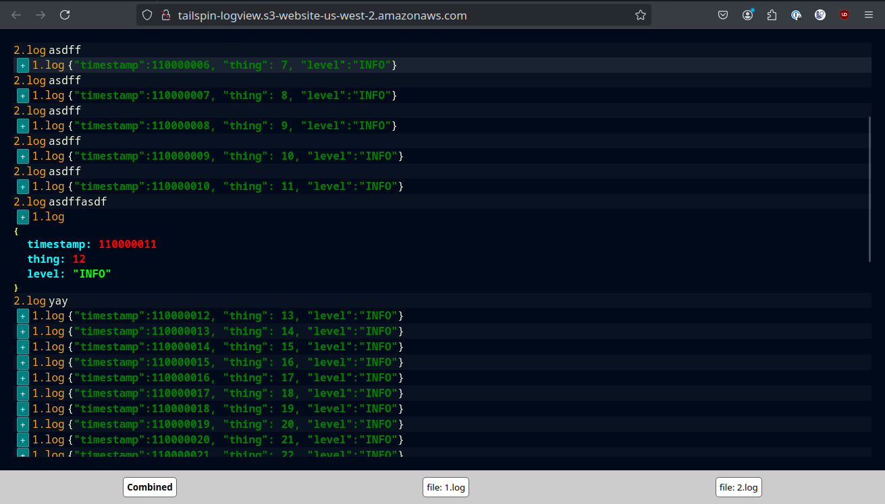

# Tailspin

A lightweight, open-source tool designed to streamline local log file monitoring
during development. It consists of:

* Rust Binary: a minimal and auditable log file watcher that sends each new line
  as a websocket message
* Web GUI: a flexible interface for viewing and navigating log data over
  websockets

Tailspin is ideal for local development environments with multiple services–-a
simpler alternative to crowded terminal outputs or 3rd party SaaS tools that
don't work for local logs.

## Installation

currently you have to clone the repo, and build things locally. helpful commands located in a
[justfile](https://github.com/casey/just).

for convenience, the latest version of the web GUI is published here:
http://tailspin-logview.s3-website-us-west-2.amazonaws.com/ ...but you can run it locally and/or
hack together your own viewer.

## todo

- add search/filter
- retain expanded json memory
- add expand all json button
